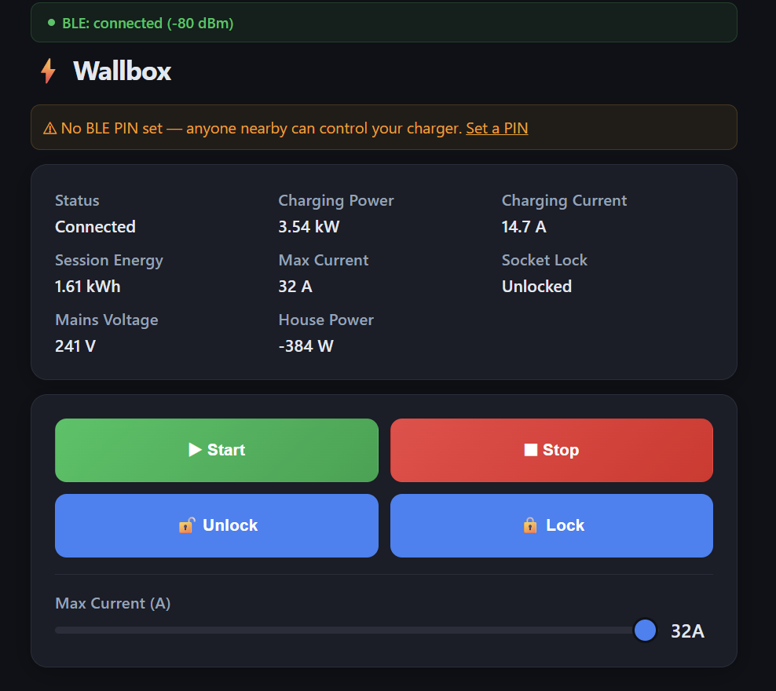
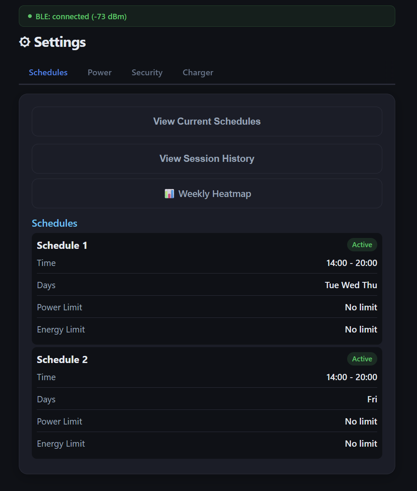
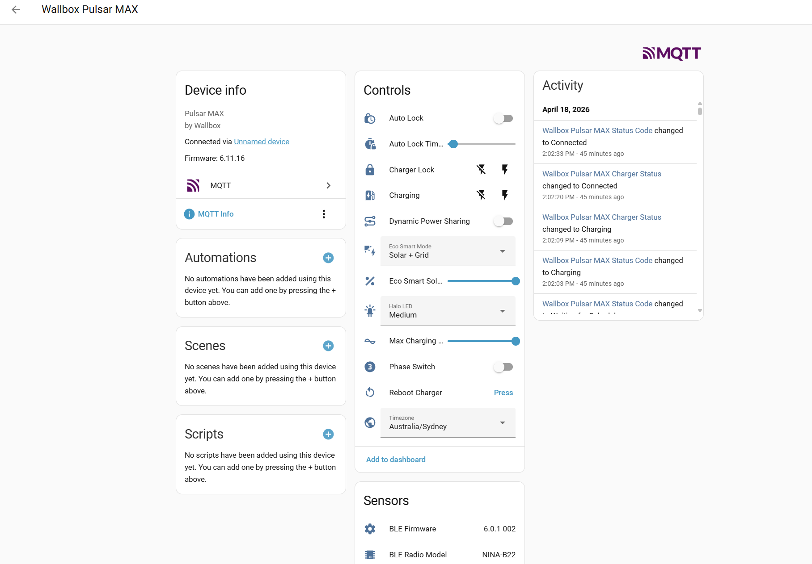

<p align="center">
  
</p>

# ESP32 Wallbox BLE Gateway

> **Local BLE → MQTT gateway for the Wallbox Pulsar MAX. Full Home Assistant control with zero cloud, in ~$15 of hardware.**

<p align="center">
  
</p>

[](https://github.com/botts7/esp32-wallbox/actions/workflows/build.yml)
[](https://github.com/botts7/esp32-wallbox/releases/latest)
[](LICENSE)
[](https://github.com/botts7/esp32-wallbox/stargazers)
[](https://platformio.org/)
[](https://www.home-assistant.io/)

✓ **No cloud** · talks BLE directly to your charger
✓ **HA Energy dashboard** ready — lifetime kWh sensor wired
✓ **~30 entities** auto-discovered (start/stop, schedules, eco-smart, halo, current limit…)
✓ **Self-hosted web UI** — dashboard, weekly heatmap, daily charging totals, CSV export
✓ **OTA updates** with rollback, captive-portal first-boot

> **Disclaimer:** Independent open-source project. Not affiliated with, endorsed by, or connected to Wallbox Chargers SL. Use at your own risk; modifying charger settings may void your warranty.

### Recent releases

- **3.0.3** — Home Assistant MQTT fixes (#14): the timezone select now
  covers all major IANA zones (e.g. `Europe/Amsterdam` was missing), and the
  per-session green/grid energy sensors use `total_increasing` so HA stops
  rejecting them.
- **3.0.2** — fixes a post-OTA stale-page problem: HTML pages now send
  `Cache-Control: no-store` (browsers/PWAs were caching old JS after an
  update), open tabs auto-reload when the gateway's firmware version
  changes, and schedule-delete feedback is now honest (row stays until the
  charger confirms; clear success/error/timeout toasts).
- **3.0.1** — schedule **delete** now works (was silently broken — uses
  the charger's native `clr_sch` array form); a real one-click **web
  installer** at [botts7.github.io/esp32-wallbox](https://botts7.github.io/esp32-wallbox/)
  (Chrome/Edge, no esptool); one-click **Compatibility Report** (Info →
  Tools) for mapping new charger models; `r_lse` live-session sensors
  (per-session solar vs grid kWh split, surplus power); heap-watermark
  diagnostics on `/info`; boot overlay no longer gated on the BLE link.
- **3.0.0** — async webserver everywhere (10-step migration);
  WebSocket push channel for live dashboard state at `ws://host/ws`;
  4-step **setup wizard** at `/setup` for first-time onboarding;
  tabbed `/config` and `/info` pages; companion **HA Add-on**
  (sidebar dashboard + controls + OTA upload) and **HA Integration**
  (`custom_components/wallbox_gateway`, no MQTT broker needed);
  schedule writes finally work after silent breakage since v2.1.0;
  MQTT discovery migrated to HA Core 2026.4+ `default_entity_id`
  schema; power-flow card on the dashboard; hourly charger-clock
  auto-sync.
- **2.8.0** — `/settings` page transmitted bytes cut ~2.4× via build-
  time gzip; smart tripwire ring on /info shows recent long loop
  iterations so you can tell a one-off from a recurring pattern
- **2.7.0** — async BLE request queue: HA commands and
  `/api/command` no longer block status updates; WiFi reconnect
  moved off the main loop (`wb_net` module); event-driven, never
  polling; chunked-wait pump keeps MQTT + WS alive during BAPI
  roundtrips. New `?wait` / `?sync` / `/api/command_status` API
  surface (documented below). Comprehensive live test suite
  (api_command_async + edge_cases + longevity + hardening +
  ui_surface) under `tests/`
- **2.6.1** — protocol auto-detect for Pulsar MAX FW 6.11.26+
  (dual-char BLE switchover)
- **2.6.0** — one-publish-per-tick HA discovery (bounds
  `loop_max_ms` under broker outages); diagnostic-category
  entities for HA
- **2.5.x** — persistent CSRF token across reboots; web-auth
  rate-limit polish

Full history in [CHANGELOG.md](CHANGELOG.md); upcoming work in
[docs/ROADMAP.md](docs/ROADMAP.md).

## More screenshots

| Sessions / Heatmap | Home Assistant |
|---|---|
|  |  |

## Why this exists

The Wallbox app requires cloud connectivity for everything — even pressing "start charging" goes
through their servers, adds latency, and breaks when the internet is down. This gateway talks
**directly to your charger over Bluetooth**, giving you:

- **Instant response** (no cloud round-trip)
- **Works offline** (internet down? gateway still works)
- **Private** (nothing leaves your local network)
- **Scriptable** (full MQTT API for automations)

## Architecture

```
Home Assistant  ◄──MQTT──►  ESP32 Gateway  ◄──BLE (BAPI)──►  Wallbox Charger
```

The ESP32 sits within Bluetooth range (~10m) of your charger, maintains a persistent BLE
connection, and bridges BLE commands to MQTT with full Home Assistant auto-discovery.

### Two valid architectures — pick the one that fits

This project takes the **smart-gateway** route: the ESP32 runs the full BAPI
protocol + BGX bridge handling + status / control / discovery and publishes to
your MQTT broker. There's also an alternative community path that uses an
**HA Bluetooth Proxy** (any ESPHome-based ESP32 with `bluetooth_proxy`) +
[`jagheterfredrik/wallbox-ble`](https://github.com/jagheterfredrik/wallbox-ble)
as a Python HA custom component — in that model the proxy is a dumb radio
relay and HA itself does the BLE talking.

|  | This gateway | HA BLE Proxy + wallbox-ble |
|---|---|---|
| Protocol implementation | C++ on ESP32 | Python in HA |
| MQTT broker | Used | Not used |
| Survives HA being offline | ✓ keeps publishing | ✗ |
| Standalone (no HA needed) | ✓ | ✗ |
| Multi-charger | future (v3.0) | trivial — one proxy can see many |
| Upgrade path for new BAPI methods | firmware OTA | Python update |
| Diagnostic surface | telnet, `/api/logs`, GATT dump in firmware | HA logs |

Both work; choose based on whether you want the gateway to be self-contained
(this project) or HA-centric (the proxy path).

## Features

### Live monitoring
- Charging power (kW), current per phase (A), session energy (kWh)
- Total lifetime energy from the charger's MID meter
- Mains voltage, whole-house power consumption
- Charger status (Ready / Plugged In / Charging / Scheduled / etc.)
- BLE signal strength

### Control
- Start / stop / pause / resume charging
- Lock / unlock charger socket
- Adjust max charging current (6-32A slider)
- Reboot charger

### Settings
- Charge schedules with day/time/power/energy limits (full UI editor)
- Auto-lock configuration (enable + timeout)
- Eco Smart solar charging modes (Off / Solar+Grid / Full Green)
- Power sharing, phase switching
- Halo LED brightness
- OCPP configuration (URL, charger ID, password)
- Timezone selection
- Weekly sessions heatmap

### Home Assistant integration
- 30+ auto-discovered entities (sensors, switches, numbers, selects, buttons)
- Proper native HA types (Eco Smart = select dropdown, Auto Lock = switch, etc.)
- Diagnostic-category entities (loop_max_ms, heap_free, reentry tripwire,
  rate-limit tokens etc.) collapse into a separate HA card so the main
  device view stays clean — since v2.6.0
- HA toggles are non-blocking on the gateway main loop (commands enqueue
  through the BLE async queue) — since v2.7.0; status updates keep
  flowing while a command is in flight
- Dynamic `sw_version` reported via discovery so HA shows your exact
  firmware build
- Energy Dashboard compatible
- Time-of-use cost tracking examples in [HA docs](docs/HOME_ASSISTANT.md)

### Web UI
- Dark-themed responsive dashboard
- 4-page navigation: Dashboard, Settings, Config, Info
- PWA installable ("Add to Home Screen" on mobile)
- Toast notifications, inline editors, loading spinners

### Admin
- Captive portal AP mode for first-boot setup
- Web config UI with NVS persistence
- OTA updates (web upload + ArduinoOTA)
- Dual partition table with automatic rollback on failed updates
- mDNS: `http://wallbox-gw.local` — rebound automatically on every
  WiFi reconnect so service-discovery clients always see the right IP
- Optional web authentication (rate limiting + lockout)
- CSRF protection on state-changing endpoints — token persists in NVS
  across reboots so a logged-in browser session survives a firmware
  update without re-auth
- Connection Diagnostics on /info: latched `loop_max_ms`, recent-events
  smart tripwire (last 8 long iterations with timestamps so you can
  tell a one-off from a recurring spike), BLE / MQTT / WiFi reconnect
  counters, NVS-persisted disconnect-event history across boots

## Compatible Chargers

| Model | Status |
|---|---|
| **Pulsar MAX** (FW 6.11.16 and earlier) | ✅ Fully tested |
| **Pulsar MAX** (FW 6.11.26+) | ✅ Working in v2.6.1+ — at this firmware Wallbox switched MAX to the dual-char BLE protocol that previously only shipped on Plus/Copper/Quasar; the gateway auto-detects the mismatch on connect and adopts the right protocol family without a reboot |
| **Pulsar Plus** | 🟡 Active prep, looking for testers |
| **Copper SB**, **Commander 2**, **Quasar / Quasar 2** | ⚪ Untested — reports welcome |

See **[COMPATIBILITY.md](COMPATIBILITY.md)** for the full matrix including
gateway-board recommendations, BLE signal-strength thresholds, and how to
contribute a report. The BAPI protocol is shared across Wallbox models;
where the BLE radio differs (u-blox / Nordic / Zentri etc.) the gateway
exposes UUID overrides in Config → Advanced.

**Want to add your charger to the supported list?** Open an issue using
the [`pulsar-plus-compat`](https://github.com/botts7/esp32-wallbox/issues/new/choose)
template (works for any model — just fill in your details) or post in
[Discussions](https://github.com/botts7/esp32-wallbox/discussions).

## Hardware

- **ESP32-S3** dev board (recommended) or any ESP32 with BLE 4.2+
  - [ESP32-S3-WROOM-1U-N16R8](https://www.espressif.com/en/products/modules/esp32-s3) with IPEX antenna = best range
  - ESP32-S3-DevKitC-1 = easiest (built-in antenna)
- USB-C cable for initial flashing (OTA thereafter)
- 5V USB power supply (any phone charger works)

No wiring, sensors, or peripherals needed — just the ESP32.

## Quick Start

### 🪄 One-click install (Chrome / Edge)

Plug the ESP32-S3 in via USB, then open the web installer and click
**Install**. The browser handles erase + flash of all three files at the
correct offsets — no terminal, no esptool, no manual offsets.

### 👉 [Open the Wallbox Gateway web installer](https://botts7.github.io/esp32-wallbox/)

> Needs desktop **Chrome** or **Edge** (Web Serial). Safari / Firefox can't
> flash — see [INSTALL.md](INSTALL.md) for other options.

After flashing:

1. Connect to WiFi AP `WallboxGW-Setup` (password `wallbox123`)
2. Open `http://192.168.4.1/` in a browser
3. Configure WiFi, MQTT, BLE address (tap **Scan** to find your charger)
4. Save & Reboot → gateway appears at `http://wallbox-gw.local/`

### Other install methods

See **[INSTALL.md](INSTALL.md)** for:
- Browser-based flashing with [esptool.spacehuhn.com](https://esptool.spacehuhn.com) (Safari / Firefox)
- Command-line `esptool.py` (automation, scripts)
- Build from source with PlatformIO
- **Recovering a board that won't boot**

### After first-boot setup

- Dashboard: `http://wallbox-gw.local/` (or the IP shown in Config page)
- Future updates via **OTA**: open `/ota` and upload the new firmware
  `.bin` only — no need to re-flash bootloader / partitions
- HA entities appear automatically under device "Wallbox Pulsar MAX"

## Home Assistant Setup

See [docs/HOME_ASSISTANT.md](docs/HOME_ASSISTANT.md) for:
- Complete entity list
- Dashboard YAML examples
- Automation recipes (solar surplus charging, charge complete alerts, off-peak scheduling)
- Time-of-use cost tracking with `utility_meter` (2-tier, 4-tier, seasonal)
- Energy Dashboard configuration

## Security

### BLE Security

Most Wallbox chargers ship with **no BLE PIN set** — anyone within ~10m of your charger can
control it. The gateway will warn you about this on the dashboard.

**To secure BLE**:
1. Open the Wallbox app, Settings → Security, set a PIN
2. In gateway Config → BLE → enter the same PIN
3. Gateway will auto-authenticate on each connection

### Web UI Security

Optional username/password authentication (Config → Web Security):
- Rate limiting: 1s delay per failed login
- 30s lockout after 5 failures
- CSRF tokens on all state-changing endpoints
- HTTPS not supported (ESP32 limitation — keep on trusted LAN)

### OTA Security

- ArduinoOTA password protected — defaults to `wb-XXXXXX` (last 6 hex of MAC, shown in serial log on boot). If a web auth password is set, that's used instead.
- Web OTA validates firmware magic byte before writing
- Smart rollback: firmware only validated after WiFi reconnects successfully
- BLE paused during OTA for reliable upload

## Troubleshooting

### BLE not connecting

**"Charger not visible — out of range or asleep"**
- Charger may be in sleep mode. Touch the keypad or plug in a car to wake it.
- RSSI weaker than -80 dBm = unreliable. Move ESP32 closer (even 2m makes a huge difference).
- If your ESP32 has an IPEX connector, ensure the external antenna is firmly seated.

**"Connection failed (RSSI -XX)"**
- Signal is borderline. Move closer or use external antenna.
- PC Bluetooth may be holding a connection. Disable BT on your PC to test.

### HA entities show "Unavailable"

- Gateway marks entities offline after 60s of BLE disconnect
- Check `http://wallbox-gw.local/` — if BLE bar is red, charger is out of range
- Restart HA MQTT integration if entities don't reappear within 2 minutes

### Can't reach `wallbox-gw.local`

- mDNS doesn't work on all devices (especially Android Chrome without DNS-SD)
- Use IP address directly — the gateway shows it on boot in serial and in HA as `Gateway IP` sensor
- Best fix: DHCP reservation on your router for a permanent IP

### Web UI shows cached old version

- Hard refresh: `Ctrl+Shift+R` (desktop) or clear site data in phone browser
- Gateway uses boot-time version query string to bust cache on new firmware
- Service worker purges cache on every install

### OTA upload "No response"

- ESP32 is busy with BLE command. Retry — should work on second attempt.
- Check serial: if BLE is actively connecting, wait 30s and retry.

## MQTT Reference

### Published Topics

| Topic | Content | Interval |
|-------|---------|----------|
| `wallbox/status` | r_dat response (power, current, session energy) | 10s |
| `wallbox/realtime` | r_sta response (detailed status, lock, phases) | 30s |
| `wallbox/settings` | Merged settings (auto lock, eco smart, etc.) | 30s |
| `wallbox/response/meter` | r_dca response (voltage, house power, lifetime energy) | 10s |
| `wallbox/response/gateway` | Gateway diagnostics (IP, uptime, heap, RSSI) | 60s |
| `wallbox/availability` | `online` / `offline` | 30s + on change |

### Command Topics

| Topic | Payload | Action |
|-------|---------|--------|
| `wallbox/cmd/charging` | `start` / `stop` | Start/stop charging |
| `wallbox/cmd/current` | `6`-`32` | Set max current (A) |
| `wallbox/cmd/lock` | `lock` / `unlock` | Socket lock |
| `wallbox/cmd/reboot` | `1` | Reboot charger |
| `wallbox/cmd/autolock_enable` | `1`/`0` or `ON`/`OFF` | Auto lock switch |
| `wallbox/cmd/autolock_time` | `60`-`600` | Lock timeout (seconds) |
| `wallbox/cmd/eco_mode` | `Off` / `Solar + Grid` / `Full Green (Solar Only)` | Eco Smart mode |
| `wallbox/cmd/eco_power` | `0`-`100` | Solar target (%) |
| `wallbox/cmd/power_sharing` | `1`/`0` | Dynamic power sharing |
| `wallbox/cmd/phase_switch` | `1`/`0` | Phase switching |
| `wallbox/cmd/halo` | `Off` / `Low` / `Medium` / `High` | LED brightness |
| `wallbox/cmd/timezone` | `Australia/Sydney` (any IANA zone) | Set timezone |
| `wallbox/bapi` | `{"met":"r_dat","par":null}` | Raw BAPI command |

### HTTP `/api/command` query parameters (since 2.7.0)

The gateway also exposes a direct BAPI passthrough at
`GET /api/command?action=bapi&met=<method>&par=<value>` which the
web UI uses internally and external scripts can drive directly.
Two query knobs control sync vs async behavior:

| Param | Range | Default | Effect |
|-------|-------|---------|--------|
| `wait` | `0`-`8000` ms | `5000` | How long the gateway waits for the BAPI response inline. On completion within the window: `200` + response body. On timeout: `202` + `{"id":N,"status":"pending"}`. |
| `wait=0` | | | Pure async — return `202` immediately, response will be published to `wallbox/response/<met>`. |
| `sync` | `0`/`1` | `0` | `sync=1` preserves the pre-2.7.0 byte-for-byte blocking shape (use only if your client can't handle 202). |

Poll a pending async response:

```
GET /api/command_status?id=<reqId>
```

Returns:
- `200` + body — response landed
- `202` + `{"id":N,"status":"pending"}` — still in flight
- `410 Gone` — `id` is from a different gateway boot or never issued
- `400` — missing or zero `id`

Backward compatibility: existing scripts that don't pass `?wait` or
`?sync` continue to work unchanged; the `5000` ms default matches the
pre-2.7.0 `sendCommand` internal timeout.

## Development

### Project structure

```
esp32-wallbox/
├── src/
│   ├── main.cpp              # Setup, loop iteration tracker, OTA admission, telnet log
│   ├── wb_ble.cpp            # BLE client (NimBLE), BAPI framing, async request queue
│   ├── wb_mqtt.cpp           # MQTT bridge, one-publish-per-tick HA auto-discovery
│   ├── wb_web.cpp            # 4-page web UI + REST API + chunked-wait pump
│   ├── wb_ws.cpp             # WebSockets server (live status / meter / BLE push)
│   ├── wb_net.cpp            # Event-driven WiFi reconnect + mDNS rebind (2.7.0)
│   ├── wb_config.cpp         # NVS config manager
│   ├── wb_diag.cpp           # Reconnect counters, smart tripwire ring, loop-max gate
│   ├── wb_health.cpp         # OTA validation, boot-history persistence
│   ├── wb_ota_history.cpp    # Persisted last-N OTA attempts
│   ├── wb_log.cpp            # Serial + telnet ring buffer for /api/logs
│   ├── wb_watchdog.cpp       # FreeRTOS task watchdog wiring
│   └── bapi.cpp              # BAPI protocol method constants + helpers
├── include/                  # Public headers, one per src/ module
├── docs/
│   ├── HOME_ASSISTANT.md     # HA integration guide
│   ├── ROADMAP.md            # Living backlog with release targets
│   ├── LOVELACE_CARD.yaml    # Drop-in HA dashboard card
│   ├── plans/                # Per-task implementation plans
│   └── screenshots/
├── tests/                    # Live integration tests (run against a real gateway)
│   ├── api_command_async.py  # 13 tests — /api/command contract + latency
│   ├── edge_cases.py         # 13 tests — parallel correlation, URL clamps, backpressure
│   ├── longevity.py          # Memory soak, WS resilience, MQTT command storm
│   ├── hardening.py          # Reusable burst + charger-monitor harness
│   └── ui_surface.py         # 18 probes mirroring every UI BAPI fetch
├── tools/
│   └── ble_monitor.py        # Serial diagnostic tool
├── scripts/
│   ├── version.py            # PIO pre-script: bake git-describe into WB_VERSION
│   └── precompress_settings.py  # PIO pre-script: gzip /settings body → PROGMEM
├── partitions_ota.csv        # Dual OTA partition table
└── platformio.ini            # Build config (ESP32-S3 + OTA env)
```

### BAPI Protocol

The BAPI (Bluetooth API) protocol uses JSON over BLE GATT:

```
Request:  EaE | length(1B) | JSON | checksum(1B)
Example:  EaE\x20{"met":"r_dat","par":null,"id":1}\x09

Response: Raw JSON (no framing)
Example:  {"id":1,"r":{"L1":0,"L2":0,"L3":0,"cp":0.0,"cur":32,...}}
```

See `include/bapi.h` for all 70+ method names (r_dat, r_sta, w_cha, w_mxI, s_alo, s_ecos, etc.)

### Tools

- `tools/ble_monitor.py` — Parse serial output, show scan success rate, response times,
  and disconnects. Usage: `python ble_monitor.py --port COM4`
- Importable as module: `from ble_monitor import WallboxMonitor`

### Tests

Live integration tests run against a real gateway over the network — see
[tests/README.md](tests/README.md) for setup. Quick start:

```bash
pip install requests websocket-client paho-mqtt
export WB_GATEWAY=http://wallbox-gw.local
export WB_AUTH_PASS=...    # only if web auth is enabled
python -m unittest tests.api_command_async tests.edge_cases tests.longevity -v
python -m tests.ui_surface && python -m tests.hardening
```

The suite covers the async `/api/command` contract, URL edge cases,
parallel correlation, memory soak, WebSocket resilience, MQTT command
storm (opt-in), and every BAPI fetch the UI makes.

## Contributing

Contributions welcome! Please:
1. Open an issue first to discuss significant changes
2. Follow existing code style (C++ follows Arduino conventions)
3. Test on actual hardware before submitting PR
4. Update CHANGELOG.md with your change

### Contributors

- [@benvanmierloo](https://github.com/benvanmierloo) — BLE SMP pairing for
  newer Wallbox firmware (≥ 6.11.26), telnet log server
  ([#1](https://github.com/botts7/esp32-wallbox/pull/1))
- [@peter-mcc](https://github.com/peter-mcc) — Tester reports that drove
  the loop-max-ms tripwire, MQTT reconnect-grace gate, and the 2.6.0
  one-publish-per-tick HA discovery refactor
- [@mvanlijden](https://github.com/mvanlijden) — Field report
  ([#11](https://github.com/botts7/esp32-wallbox/issues/11)) of the
  MAX-at-6.11.26 protocol-family mismatch that became the 2.6.1 auto-
  detect fix

## Related Projects

- [Official HA Wallbox integration](https://www.home-assistant.io/integrations/wallbox/) —
  cloud-based, covers session cost / billing history. Complements this gateway (local vs. cloud).
- [`jagheterfredrik/wallbox-ble`](https://github.com/jagheterfredrik/wallbox-ble) — HA
  component for local BLE control of the Pulsar **Plus** (sibling to this project).
- [`jagheterfredrik/wallbox-mqtt-bridge`](https://github.com/jagheterfredrik/wallbox-mqtt-bridge) —
  Runs **on the Wallbox itself** (requires rooting). 1 Hz polling via internal Redis, no
  BLE. Supports Pulsar Plus / Copper SB. Different trade-off than ours: faster updates,
  but you have to root the charger.

## License

MIT — see [LICENSE](LICENSE).

"Wallbox" and "Pulsar" are trademarks of Wallbox Chargers SL. This project is not
affiliated with, endorsed by, or connected to them in any way.
